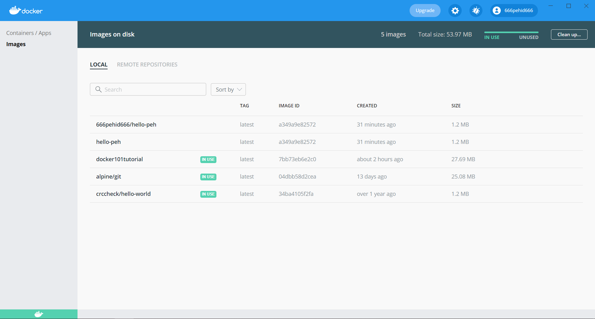
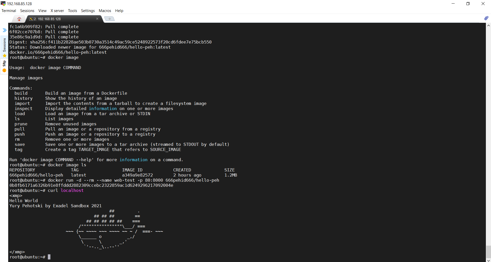
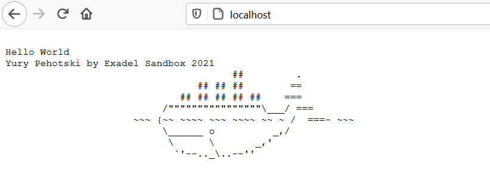

# Task 02
> Docker
> Docker hub ID 666pehid666
> 

##### [DONE] 1. Install docker. (Extra points: install docker for both platforms(linux and windows)). Hint: please use VMs for this.

##### [DONE] 2. Find, download and run any docker container "hello world". (Learn commands and parameters to create/run docker containers. (Extra points: use image with html page, edit html page and paste text: <Username> Exadel Sandbox 2021)

##### [DONE] 3. A) Create your Dockerfile for building a docker image. Your docker image should run any web application (nginx, apache, https). Web application should be located inside the docker image. (Extra points: for creating docker image use clear basic images (ubuntu, centos, alpine and etc.))
##### B) add an environment variable "DEVOPS=<username> to your docker image (Extra points: print environment variable with the value on a web page (if environment variable changed - the web page must be updated with a new value)

Dockerfile in folder task02

##### 4. Push your docker image to docker hub (https://hub.docker.com/). Create any description for your Docker image. Integrate your docker image and your  github repository (Extra points: create automatically deployment for each push)

##### 5. Create docker-compose file. Deploy a few docker containers via one docker-compose file. 
##### A) first image - your docker image from the previous step.
##### B) second image - any java application
##### C) last image - any database image (mysql, postgresql, mongo or etc.)
##### [Second container should be run right after a successful run of a database container.
##### 5 nodes of the first image should be run.
    (Extra points: use env files to configure each service) 