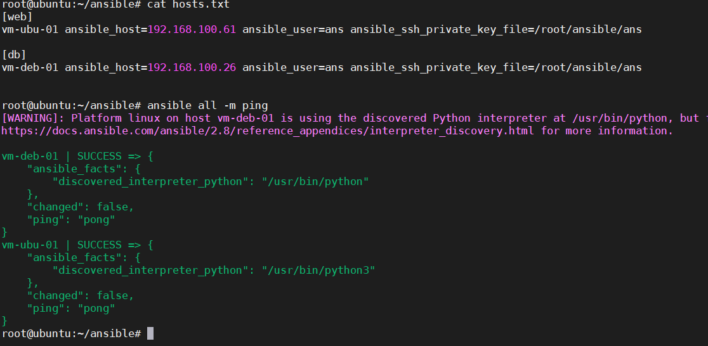

# Task 3: Ansible for beginners
> Ansible

[DONE] Теория:

1. IaC ознакомиться с концепцией
2. Преимущества и недостатки Ансибла над другими инструментами 
3. Ознакомиться с основами ансибла и синтаксисом YML
4. Основы работы с ансиблом из официальной документации
5. \* Jinja2 темплетинг - почитать документацию

> Workflow
> help links
>  - https://docs.ansible.com/ansible/latest/user_guide/playbooks_best_practices.html
>  - https://github.com/ansible/ansible-examples
>  - https://habr.com/ru/company/ua-hosting/blog/490502/
>  - https://galaxy.ansible.com/
>  - https://www.devopsschool.com/blog/deep-dive-into-jinja2-ansible-template-with-example/

Практика:

1. Установить Ансибл версии 2.8.10 (можно другую версию, но на свой страх и риск) на свой дистрибутив
> apt-add-repository --yes --update ppa:ansible/ansible
>
> apt install python3-pip
>
> pip3 install 'ansible==2.8.10'
2. Ping pong - выполнить встроенную команду ансибла ping (для этого достаточно одной ВМ, но можно выполнить на нескольких - для наглядности)

3. Мой Первый Плейбук - написать плейбук по установке nginx
 и выполнить его (плейбук положить в ситовый репозиторий для ознакомления)
> git: pb_web_nginx.yml
> run:  ansible-playbook pb_web_nginx.yml --ask-become-pass
4. \* Написать плейбук по установке одного из (LAMP/LEMP стек, Wordpress, ELK, MEAN) - GALAXY нельзя
***hardcore - вышесказанные плейбуки не должны иметь дефолтных кредов к базам данных и/или админка
> [DRAFT]
> git: pb_elk.yml
>
>
