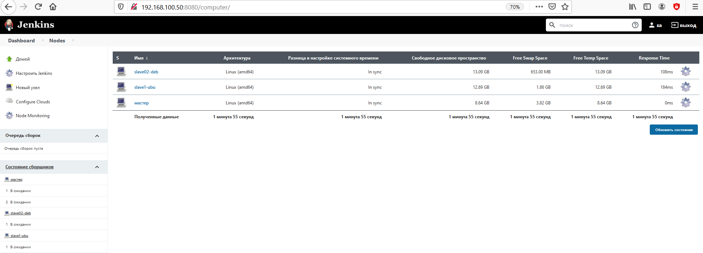
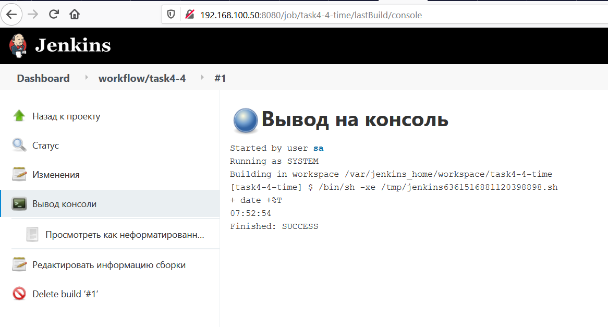
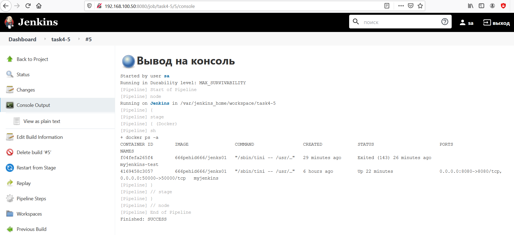
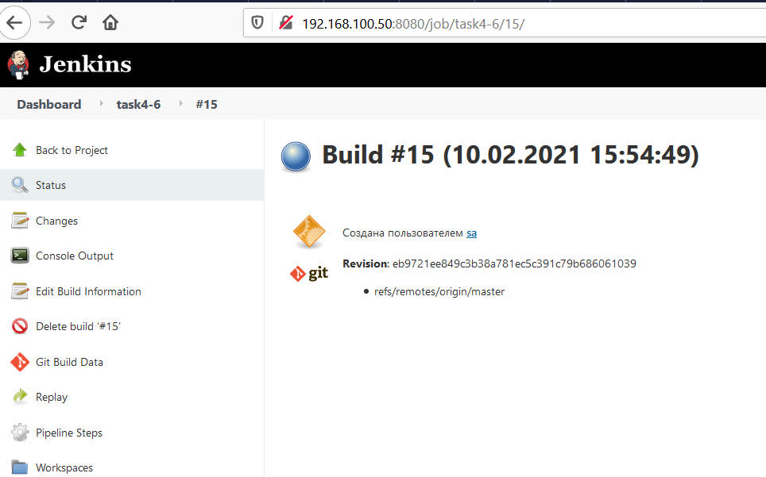

# Task 4: Jenkins. Control it.
> Jenkins. Автоматизируй, Управляй и Контролируй

[DONE] 0. Почитать про Jenkins. Что это такое и для чего он нужен? Способы применения. Что такое императивное и декларативное программирование
```
почитано)
```

[DONE] 1. Установить Jenkins (необходимо использовать Jenkins в Docker)
```
in git: Dockerfile
```

[DONE] 2. Установить необходимые плагины (если потребуются на ваше усмотрение)
```
установлено)
```

[DONE] 3. Настроить несколько билд агентов
```
скриншот
```
<details>
<summary>Workflow screenshots</summary>

</details>

[DONE] 4. Создать Freestyle project. Который будет в результате выполнения на экран выводить текущее время
```
скриншот
```
<details>
<summary>Workflow screenshots</summary>

</details>

[DONE] 5. Создать Pipeline который будет на хосте выполнять команду docker ps -a
```
скриншот
```
<details>
<summary>Workflow screenshots</summary>

</details>

[DONE] 6. Создать Pipeline который будет выкачивать из вашего репозитория код и будет собирать докер образ из вашего Dockerfile (который вы писали во время знакомства с докером)
```
for fastest minimal download - new rep https://github.com/geek-rb/test-jenkins/blob/master/Dockerfile
in git: task04-6_log.txt
```
<details>
<summary>Workflow screenshots</summary>

</details>

[DONE] 7. Передать переменную PASSWORD=QWERTY! В зашифрованном виде в докер контейнер

```
in git: task04-7_log.txt
in git: task04-7.groovy
```
<details>
<summary>Workflow screenshots</summary>


</details>


Бонусные задания:

8. Написать pipeline который будет на дополнительной виртуальной машине запускать докер контейнер из вашего докерфайла
9. Написать ансибл скрипт который будет разворачивать дженкинс
10. Развернуть локальный docker registry загрузить в него докер образ, выгрузить докер образ из docker registry и запустить контейнер на окружении (с использованием Jenkinsfile)
11. Настроить двухстороннюю интеграцию между Jenkins и ваш Git репозиторий. Jenkins проект будет запускаться автоматически при наличии изменений в вашем репозитории а также в Git будет виден статус последней сборки из дженкинса (успешно/не успешно/в процессе)
