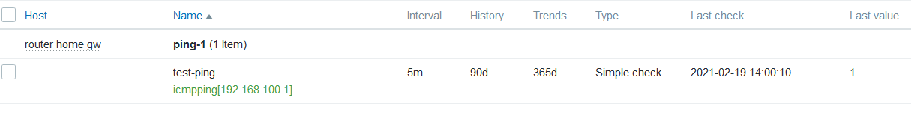

# Task 6: Logging&Monitoring. Big Brother.
> Мониторинг: Город засыпает просыпается ....
---

(1) Zabbix:
[DONE]1. Установить на сервер - сконфигурировать веб и базу 
```
сделано 
```
---
[DONE]2. Поставить на подготовленные ранее сервера или виртуалки заббикс агенты - (EXTRA: сделать это ансиблом)
```
git: 6-1-2_inst_agent.yml
```
<details>
<summary>Workflow SCREEN</summary>

</details>

---
[DONE]3. Сделать несколько своих дашбородов, куда вывести данные со своих триггеров (например мониторить размер базы данных из предыдущего задания и включать алерт при любом изменении ее размера - можно спровоцировать вручную )
```
попытки мониторить размер бд неуспешны, если запрашивать как файловую функцию - ошибка доступа (сделать рутом агент в дебиане не получилось) поэтому сделал тестовый тригер на изменение занятого места
```
<details>
<summary>Workflow SCREEN</summary>

</details>
---

[DONE]4. Active check vs passive check - применить у себя оба вида - продемонстрировать.
```
Если правильно понял, это режимы работы агента - пассивный и активный, разница в том, что пассивный шлет данные согласно запросам с сервера, активный клиент сначала получает список метрик, и потом шлет их на сервер
---
<details>
<summary>Workflow SCREEN</summary>

</details>
[DONE]5. Сделать безагентный чек любого ресурса (ICMP ping)
'''
пинганул роутер
```
<details>
<summary>Workflow SCREEN</summary>

</details>
---

[DONE]6. Спровоцировать алерт - и создать Maintenance инструкцию 
```
сделал алерт, по тригеру запускается с сервера скрипт (для примера трэйсроут до проблемного хоста)
```
<details>
<summary>Workflow SCREEN</summary>


</details>
---

[DONE]7. Нарисовать дашборд с ключевыми узлами инфраструктуры и мониторингом как и хостов так и установленного на них софта
```
рисовали как умеем)
```
<details>
<summary>Workflow SCREEN</summary>

</details>


---

(2) ELK: 
Никто не забыт и ничто не забыто.

[DONE]1. Установить и настроить ELK
```
screen 
```
<details>
<summary>Workflow SCREEN</summary>

</details>

---


[DONE]2. Организовать сбор логов из докера в ELK и получать данные от запущенных контейнеров

```
пример получаемых данных

@timestamp:    Feb 18, 2021 @ 16:42:46.355
version:    1.1
message:    Running from: /usr/share/jenkins/jenkins.war
created:    Feb 18, 2021 @ 16:42:45.089
container_name:    myjenkins
level:    6
type:    gelf
image_id:    sha256:c85b3dde00f00db841947db97a49004b2c1ec7ce71011a83f8907e39b93188e1
image_name:    666pehid666/jenks01
command:    /sbin/tini -- /usr/local/bin/jenkins.sh
container_id:    2303b02c340f481c674b868da95ab09b0a4242ab5bb6502f0da3979b03d8410e
tag:    2303b02c340f
host:    ubuntu
source_host:    192.168.100.50
_id:    b7RgtXcBP3j2KDLq9VTY
_type:    _doc
_index:    %{[gelf]}-2021.02.18

screen
```
<details>
<summary>Workflow SCREEN</summary>

</details>

---

3. Настроить свои дашборды в ELK
```
креатива не получилось(
```
---
[DONE]4. EXTRA: Настроить фильтры на стороне Logstash (из поля message получить отдельные поля docker_container и docker_image)
```
случайно сделано) //второе задание скрины
```
---
[DONE]5. Настроить мониторинг в ELK - получать метрики от ваших запущенных контейнеров
```
old: не сделал достаточно информативную выгрузку с докера
new: ткнули мордаохй в очевидное - использовать metricbeats модуль docker
столкнулся с проблемой, на хосте докера в конфиге /etc/metricbeat/metricbeat.yml правка в секции kibana ключа
host: "<my_elk_ip>:5601"
не помогает, setup все равно стучится на адрес localhost:5601

меняем ключ на этот:
setup.kibana.host: "<my_elk_ip>:5601"
и все работает)

еще фишка на елк, при попытке примапить elasticsearch к внешнему адресу
   /etc/elasticsearch/elasticsearch.yml
   network.host: <my_public_ip>
тоже не работает))
помогло 2х часовое изучение мануалов и это:
   network.host: localhost
   http.bind_host: <my_public_ip>

еще грабли, когда эластик не стартовал автоматически - в журнале была эта ошибка
multipathd[651]: sda: add missing path
multipathd[651]: sda: failed to get udev uid: Invalid argument
multipathd[651]: sda: failed to get sysfs uid: Invalid argument

помоглo добавить в конец файла vmx виртуальной машины (VMware Workstation 16 Pro)
disk.EnableUUID = "TRUE"


следующее, при перезагрузке сервера ооочень долго выключается logstash
решение:
/etc/systemd/system/logstash.service
Set parameter:
TimeoutStopSec=180
и systemctl daemon-reload

сделано
```
<details>
<summary>Workflow SCREEN</summary>

</details>
---

6. Посмотреть возможности и настройки

 (3) Grafana:
```
не делал, не успею, да и хотелось бы сначала сделать нормальный выход логов как с хоста докера, так и конкретных контейнеров, а потом уже оперировать этими данными и рисовать розовых пони
```
1. Установить Grafana интегрировать с установленным ELK
2. Настроить Дашборды
3. Посмотреть возможности и настройки